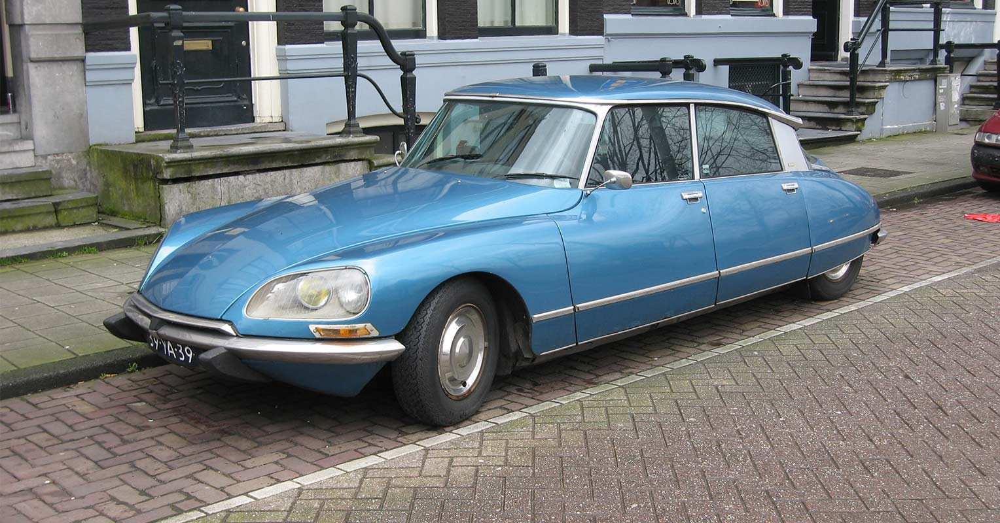
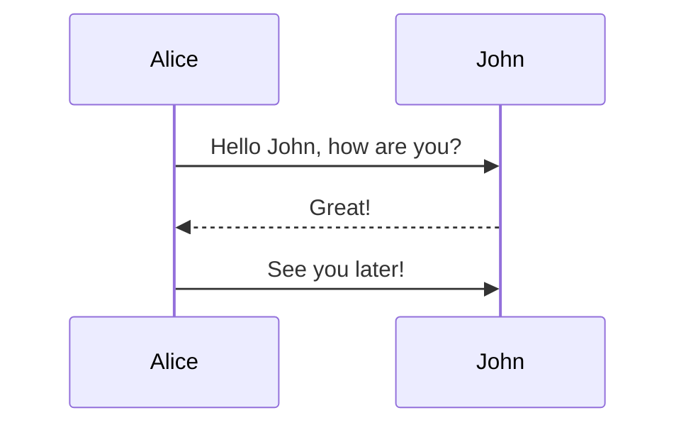

# Titulo

Esto es un parrafo normal.
Esto es otro parrafo.

# Otro titulo

Este *texto* esta en un   *cursiva* y este texto
 esta en __negrita__  

## Nivel 2

### nivel 3

- Primer elemento
- Segundo elemento
  - Subelemento
  - Subelemento2
- Tercer elemento

1. Primer elemento numerado
2. Segundo
3. tercero
    1. 3.1
    2. 3.2

- [x] Tarea1
- [ ] Tarea2

> Esto es una cita , un comentario, una aclaracion.
> Esto es otra linea de cita
> > Cita anidada
> otra *linea*
>
> - Lista1
> - Lista2



[soporte](https://www.cotarelo.ga/soporte/)

[otro documento](markdowntest.md)

[Enlace a un titulo](#nivel-3)

#### nivel 4

A continuacion mostramos un fragmento de código Java:

```java
public class HolaMundo {

  public static void main(String[] args) {
    System.out.println("Hola Mundo");
  }

}
```

En el codigo anterior ,`main` es el nombre del metodo principal.

Para subirlo a Git

```bash
git push origin main
```

Siendo `main` la rama principal
del repositorio.

:heart:
:soccer:
✌

\`\`\`
\#
\-
\!

Si escribo \_cursiva\_ se renderiza como *cursiva*

##### nivel 5

| Encabezado 1 | Encabezado 2 | Encabezado 3 |
| --- | :--- | ---: |
| Fila 1 C1 | Fila 1 C2 | Fila 1 C3  <br>
esto es otra fila |
| Fila 2 C1 | Fila 2 C2 | Fila 2 C3 |

<html>
 <head>
  <title>Mi página de ejemplo</title>
 </head>
 <body>
 Aquí va el contenido
 </body>
</html>


La formula de la gravedad es :$F = G \frac{m_1m_2}{r^2}$

La formula de la ecuacion de la relatividad es: 
$$E=mc^2$$
 
###### nivel 6
